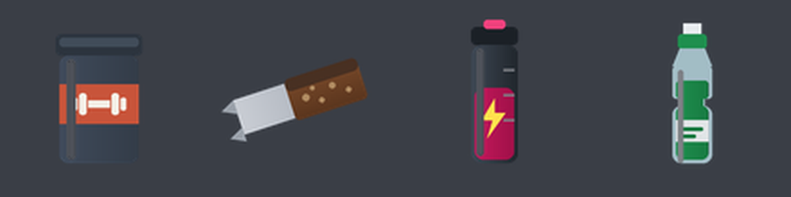

# Item images

Icons for the four consumables, as **PNG ready to use** and as **SVG sources**.



## Just use the PNGs

`whey.png`, `protein_bar.png`, `pre_workout.png` and `sports_drink.png` are here at 100x100 with a
transparent background. Copy them into your inventory's image folder (table below) and you are done.

To rebuild them after editing an SVG, or after renaming an item in `Config.Items`:

```bash
python tools/icons.py
```

That needs only Pillow, which the project's other tools already use - no ImageMagick, no Inkscape.
Pass a folder to copy them straight in:

```bash
python tools/icons.py "resources/[qb]/qb-inventory/html/images"
```

## Why SVG sources too

They ship as SVG as well for two reasons that are worth more than the convenience of a ready-made
file:

- **They scale.** qb-core slots render at roughly 100 px, ox_inventory at 64, and some custom
  inventories at 200. One source produces all of them without the blur a resized PNG gets.
- **They are editable.** They are a few dozen lines of plain text: change the whey tub's label
  colour to match your server's branding by editing one hex value.

## Converting them yourself

`tools/icons.py` above is the no-dependency path and draws the icons directly. If you have real
vector tooling it will antialias slightly better - the script compensates by drawing at 4x and
downsampling, which is close but not identical.

Any one of these produces the four PNGs. Run it from the resource root.

**ImageMagick** (simplest if you have it):

```bash
for f in images/*.svg; do magick -background none "$f" -resize 100x100 "${f%.svg}.png"; done
```

**Inkscape** (the best quality of the three):

```bash
for f in images/*.svg; do inkscape "$f" --export-type=png --export-width=100 --export-height=100; done
```

**No tooling at all**: open each `.svg` in a browser, screenshot it, or use any online SVG-to-PNG
converter. They are four small files and this is a one-off.

Keep `-background none`: an inventory slot has its own background and a white square behind every
icon looks like a bug.

## Where the PNGs go

| Inventory | Folder |
|---|---|
| qb-inventory | `qb-inventory/html/images/` |
| ox_inventory | `ox_inventory/web/images/` |
| qs-inventory | `qs-inventory/html/images/` |
| origen_inventory | `origen_inventory/html/images/` |
| codem-inventory | `codem-inventory/html/itemimages/` |

The filename must match the `image` field in `Config.Items` - `whey.png`, `protein_bar.png`,
`pre_workout.png`, `sports_drink.png`. Rename an item in the config and `/vsportitems` prints the
updated block, but the PNG has to be renamed by hand.

## If you would rather not bother

Point the config at an image the inventory already has. Nothing breaks and no file is copied:

```lua
Config.Items.whey.image = 'protein.png'          -- most inventories ship one
Config.Items.sports_drink.image = 'water_bottle.png'
```

A missing image is not fatal either - inventories fall back to a placeholder. The item still works.

---

# Images des items (francais)

Les icones des quatre consommables, en **PNG pretes a l'emploi** et en **sources SVG**.

**Le plus simple** : les quatre PNG sont deja la, en 100x100 sur fond transparent. Copiez-les dans le
dossier d'images de votre inventaire (tableau de la section anglaise) et c'est fini. Le nom du fichier
doit correspondre au champ `image` de `Config.Items`.

Pour les regenerer apres avoir modifie un SVG ou renomme un item :

```bash
python tools/icons.py
```

Cela ne demande que Pillow, deja utilise par les autres outils du projet : ni ImageMagick, ni
Inkscape. Passez un dossier en argument pour les copier directement dedans :

```bash
python tools/icons.py "resources/[qb]/qb-inventory/html/images"
```

**Pourquoi du SVG en plus** : il s'adapte a toutes les tailles sans le flou d'un PNG redimensionne
(100 px pour qb-core, 64 pour ox_inventory, parfois 200), et il est modifiable : quelques dizaines de
lignes de texte, une valeur hexadecimale a changer pour accorder le pot de whey a votre serveur.

Avec ImageMagick ou Inkscape, les commandes sont dans la section anglaise. Gardez `-background none`
: un emplacement d'inventaire a son propre fond, et un carre blanc derriere chaque icone ressemble a
un bug.

**Si vous ne voulez pas vous en occuper du tout** : pointez la config vers une image que votre
inventaire possede deja (`Config.Items.whey.image = 'protein.png'`). Une image manquante n'est pas
fatale non plus, l'inventaire affiche un substitut et l'item fonctionne.
